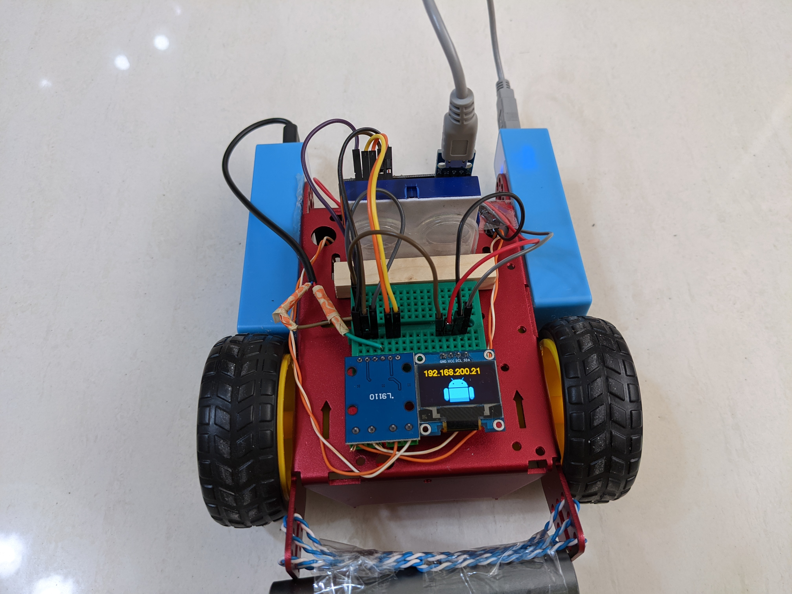
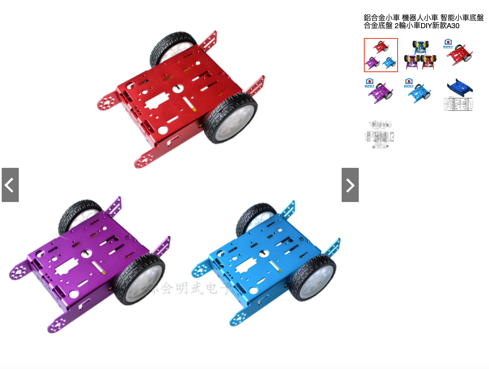
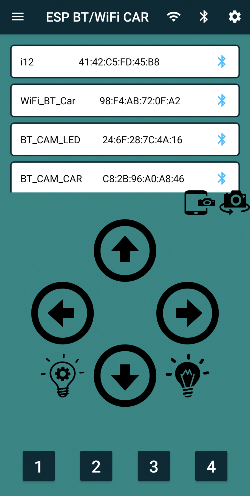
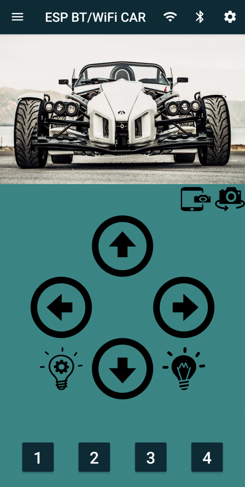
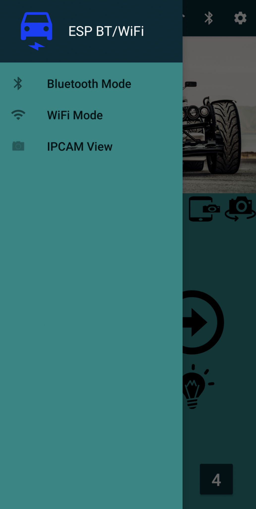
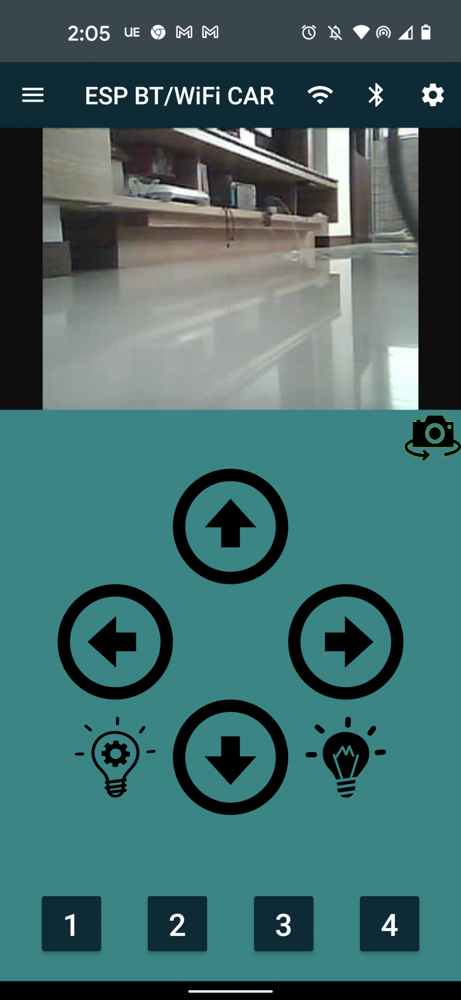

# ESP Bluetooth/WiFi Car

<p align="center">

</p>


## All in one RC Car with WiFi and Bluetooth, and OLED (optional)

Most of remote control Robot Cars use WiFi or Bluetooth protocol only.
Thanks for ESP32-CAM, we could build RC robot with Camera with both WiFi and Bluetooth protocol.

ESP32-CAM Car
* build the wifi car
* develop the HTTP server with streaming video & motor control
* develop the Bluetooth command
* develop the mobile application

ESP32 Car (w/o CAM)
* build the wifi car
* develop the HTTP server with streaming video & motor control
* develop the mobile application

ESP8266 Car (w/o CAM & Bluetooth)
* build the wifi car
* develop the HTTP server with streaming video & motor control
* develop the Bluetooth command
* develop the mobile application

## How it works

We are using HTTP protocol and Bluetooth Serial port command.

For Bluetooth, it's ESP32 only. We use Bluetooth Serial to control the car.

For WiFi, The server is the ESP32/ESP8266 and the client is the smartphone. The client will send HTTP requests to the server in order to control the car.

ESP32/ESP8266 chip is able to create its own WIFI network (Access Point mode = AP) or to connect to an existing wifi network (Station Mode = STA). 

The smartphone must be connected to the same wifi network as the chip and know its ip address and the port of its server. To make it easier, I also use an OLED display to show current IP address on the display.

## Build your own wifi car

ESP32-CAM / ESP32 DevKit / ESP8266
[Car Kit](https://shopee.tw/%E9%8B%81%E5%90%88%E9%87%91%E5%B0%8F%E8%BB%8A-%E6%A9%9F%E5%99%A8%E4%BA%BA%E5%B0%8F%E8%BB%8A-%E6%99%BA%E8%83%BD%E5%B0%8F%E8%BB%8A%E5%BA%95%E7%9B%A4%E5%90%88%E9%87%91%E5%BA%95%E7%9B%A4-2%E8%BC%AA%E5%B0%8F%E8%BB%8ADIY%E6%96%B0%E6%AC%BEA30-i.59477120.3757226429)
<p align="center">

</p>

You can also find another [Car Kit](https://www.amazon.com/perseids-Chassis-Encoder-Wheels-Battery/dp/B07DNYQ3PX/ref=sr_1_21?dchild=1&keywords=WIFI+Smart+Robot+Car+With+NodeMCU&qid=1624955907&s=toys-and-games&sr=1-21)


## Upload the code into your controller

To upload the script, you can use the Arduino IDE: [link](https://randomnerdtutorials.com/how-to-install-esp8266-board-arduino-ide/)

## Configure your mobile application

You can customize all the commands with Android Apps. The apps support both WiFi comand and Bluetooth Command. You could switch between WiFi mode and Bluetooth mode via Android app.

To control RC car with WiFi, you must connect your smartphone to the same wifi network as your wifi car. Make sure that the application parameters are correct (IP, PORT, etc..). 

To control RC car with Bluetooth, you must pair the car with it's Bluetooth name, and then connect on it.

The defaults commands sent are:

Live Camera URL : (port = http port(80) +1)
```
CAM URL: http://192.168.4.1:81/stream
```

```
GET - http://192.168.4.1:80/state?cmd=F (forward)
GET - http://192.168.4.1:80/state?cmd=B (backward)
GET - http://192.168.4.1:80/state?cmd=R (right)
GET - http://192.168.4.1:80/state?cmd=L (left)
GET - http://192.168.4.1:80/state?cmd=S (stop)

GET - http://192.168.4.1:80/action?type=1 (action 1)
GET - http://192.168.4.1:80/action?type=2 (action 2)
GET - http://192.168.4.1:80/action?type=3 (action 3)
GET - http://192.168.4.1:80/action?type=4 (action 4)
```

Bluetooth Serial Comand
cmd 'L' : MotorLeft();
cmd 'R' : MotorRight();
cmd 'F' : MotorUp();
cmd 'B' : MotorDown();
cmd 'X' : MotorStop();


__Android__:
<p align="center">
  
  
  
</p>
<p align="center">
  
  
</p>


## ESP WiFi/Bluetooth RC CAM CAR

[](https://play.google.com/store/apps/details?id=com.ieeelab.bluetoothrc)


## Preview


